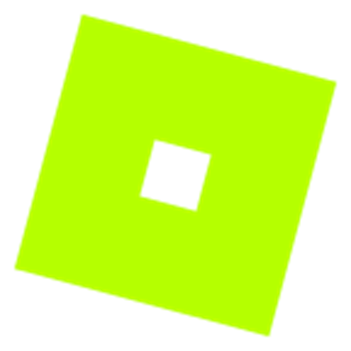
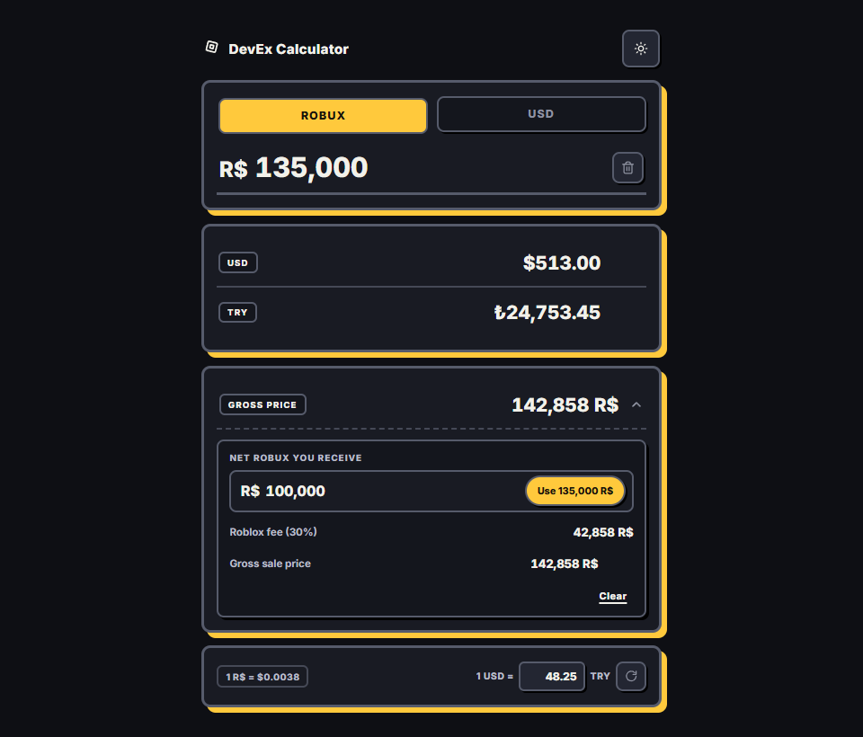
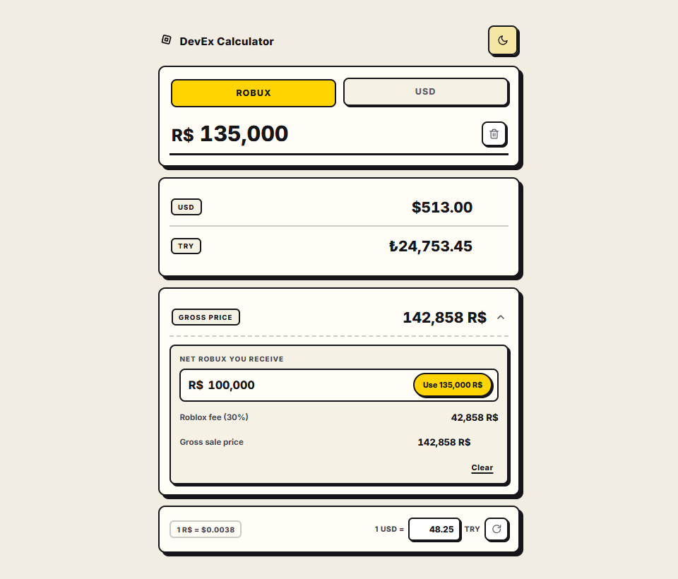

<div align="center">



# DevEx Calculator

**Robux → USD → TRY** — estimate DevEx payouts in seconds.

Zero dependencies · fully static · PWA · works offline

[**🚀 Live Demo**](https://naksipayila.github.io/DevexCalculator/)


</div>

<br />

<table align="center">
  <tr>
    <td align="center"></td>
    <td align="center"></td>
  </tr>
  <tr>
    <td align="center"><sub>🌙 Dark</sub></td>
    <td align="center"><sub>☀️ Light</sub></td>
  </tr>
</table>

---

## ✨ Features

| | |
|---|---|
| **Instant conversion** | Robux or USD entry mode; the other currencies update on every keystroke |
| **Live USD/TRY rate** | Fetched from [open.er-api.com](https://open.er-api.com/), with manual override and reset to live |
| **Gross price calculator** | Sale price needed to net a target Robux amount after the 30% Roblox fee, plus fee breakdown |
| **DevEx minimum guard** | Instant hint below the 30,000 R$ payout threshold |
| **One-click copy** | Robux, USD, TRY and gross values to the clipboard |
| **Dark / light theme** | Preference persisted in the browser |
| **Offline (PWA)** | App shell cached by a service worker; last rate served from cache |

---

## 🧮 How It Calculates

```text
USD           = Robux × 0.0038          (fixed DevEx rate)
TRY           = USD × rate              (live / manual USD-TRY)
Gross price   = ceil(Net Robux ÷ 0.70)  (to net the target after the 30% fee)
```

> The DevEx rate (1 R$ = $0.0038) and the 30% marketplace fee are set by Roblox;
> final eligibility and payout terms are determined by Roblox, not this app.

---

## ⚡ Quick Start

No install, no build — static files only:

```bash
# serve locally
python -m http.server 8000
# → http://localhost:8000
```

> The service worker and clipboard APIs require a secure context like `localhost` (`file://` won't work).

---

## Project Structure

```text
DevexCalculator/
├── index.html            # Markup, a11y, cache-busted asset refs
├── app.js                # All state, calculations, rate fetching, persistence
├── style.css             # Design tokens, dark/light theme, layout
├── sw.js                 # Cache-first app-shell service worker
├── manifest.webmanifest  # PWA manifest
└── assets/               # Screenshots
```

---

<div align="center">

Made for Roblox developers 💛

</div>
